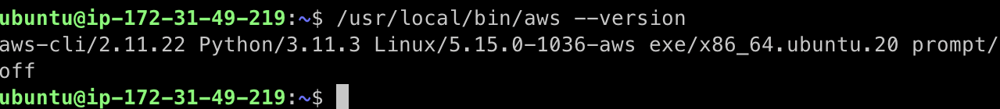
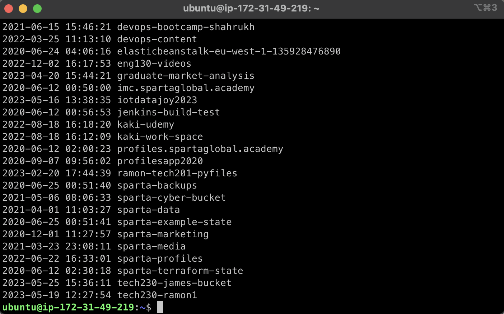
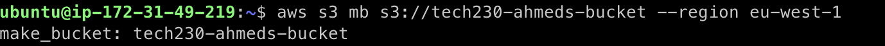
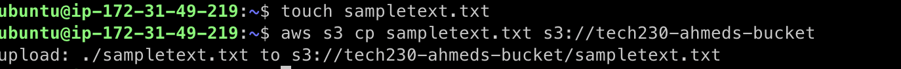
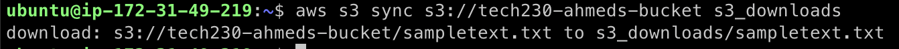
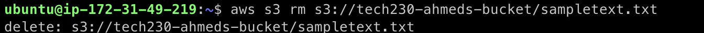
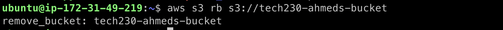

# You can follow the step by step guide below to install AWS CLI on your EC2 instance and perform CRUD operations using AWS CLI.

Prerequisties: You'll need to have an EC2 instance running with an ssh connection.

## To install AWS CLI

1. Run the commands below to install or update AWS CLI

```
curl "https://awscli.amazonaws.com/awscli-exe-linux-x86_64.zip" -o "awscliv2.zip"

sudo apt install unzip

unzip awscliv2.zip

sudo ./aws/install
```

2. To confirm AWS CLI has installed, check version with this command:

```
/usr/local/bin/aws --version
```



## To perform CRUD operations using AWS CLI

1. Update and upgrade linux pacakges using commands below:

```
sudo apt-get update -y
sudo apt-get upgrade -y
```

2. For AWS conifguration run the following commands and enter the required fields with Access Key and ID.

```
sudo apt-get install awscli
aws configure
```

3. Run `aws s3 ls` and you should see a list of buckets like below so we know our conifguration was successful.



### To create a bucket

- Run the command below to create a bucket:
  `aws s3 mb s3://tech230-ahmeds-bucket --region eu-west-1`

Output:



### To update a bucket with a file

- Run the commands below to create a file in local directory and upload it to a bucket

```
touch sampletext.txt
aws s3 cp sampletext.txt s3://tech230-ahmeds-bucket
```

Output:



### To read from a bucket by downloading a file

- Run the commands below to read from a bucket and download a file

```
aws s3 sync s3://tech230-ahmeds-bucket s3_downloads
```

Output:



### To delete a file from a bucket

- Run the commands below to delete a file from a bucket

```
aws s3 rm s3://tech230-ahmeds-bucket/sampletext.txt
```

Output:



### To delete all contents of a bucket

- Run the commands below to delete all the contents from a bucket

```
aws s3 rm s3://tech230-ahmeds-bucket --recursive
```

### To delete an entire bucket

Note: You can only delete a bucket once it is empty

Run:

```
aws s3 rb s3://tech230-ahmeds-bucket
```

Output:


